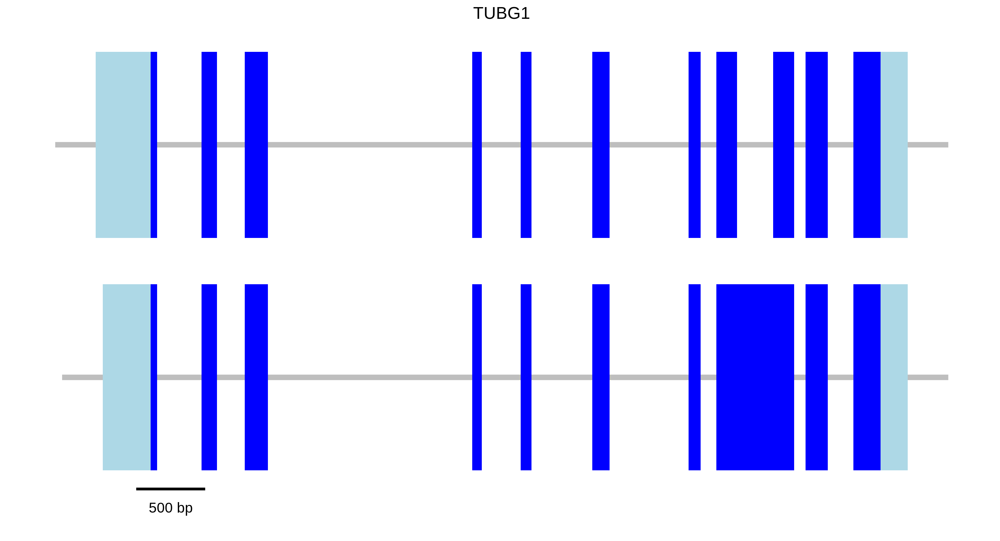
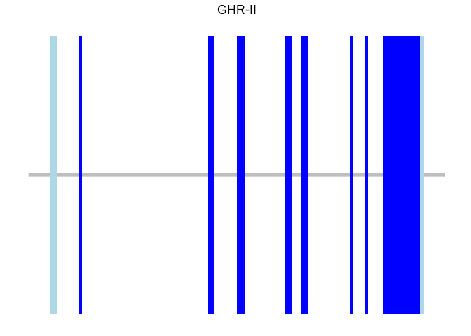
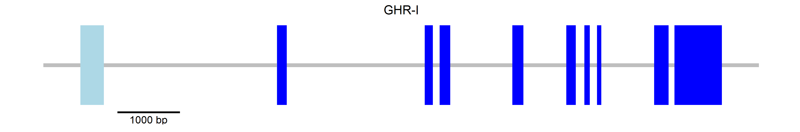
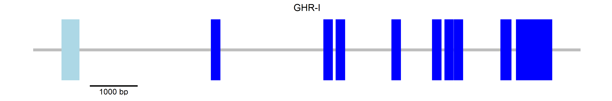

gGENEplot
=========

I present here the use of a function to parse genbank files and generate exon/intron diagrams using `ggplot`.

The following graph has been created from the human Tubulin [genbank file](https://www.ncbi.nlm.nih.gov/nuccore/NC_000017.11?report=genbank&from=42609340&to=42615238)



Installation
============

Download the repository from [github](https://github.com/alfonsosaera/gGENEplot.git) or clone it by typing in the terminal

    git clone https://github.com/alfonsosaera/gGENEplot.git

Usage
=====

You can copy the function from the `gGENEplot_function.R` file or load it using `source`

``` r
source("gGENEplot_function.R")
```

A simple plot with a single transcript can be created with the following code

``` r
gGENEplot("gb_files/sequence.gb")
```

    ## Loading required package: gsubfn

    ## Loading required package: proto

    ## Loading required package: ggplot2



and save it using `ggsave`, which also allows you to modify its proportions

``` r
ggsave("README_files/sequence.png", width = 30, height = 5, units = "cm")
```


Scale bar
---------

An scale bar can be added using `bar`

``` r
p <- gGENEplot("gb_files/sequence.gb", bar = T)
ggsave("README_files/sequence2.png", width = 30, height = 5, units = "cm")
```


and further customized with `bar.pos`, `bar.color`, `bar.size` and `bar.length`

``` r
p <- gGENEplot("gb_files/sequence.gb", bar = T,
               bar.pos = "top",    # "bottom" (default) or "top"
               bar.color = "gray", # default is black
               bar.size = 4,       # size of scale bar line in points
               # bar.size default is line.size/2 
               # see appearance for details on line.size
               bar.length = 500    # length in base pairs
               )
ggsave("README_files/sequence3.png", width = 30, height = 5, units = "cm")
```


Appearance
----------

``` r
p <- gGENEplot("gb_files/sequence.gb", bar = T,
               line.color = "blue",   # color of the "genome" line
               line.size = 8, # size of "genome" line in points, default is 2
               line.overhang = 0.3,   # portion of the line before/after gene
               intron.color = "green", exon.color = "red",
               bar.size = 1) 
ggsave("README_files/sequence4.png", width = 30, height = 5, units = "cm")
```


The `line.overhang` argument can be set to a percentage of the total length of the gene (0 to 1) or an absolute length in base pair number (&gt;1)

The `min.size` argument controls the minimum size that an exon must have so it can be visible, if an exon is smaller will be enlarged. As the `min.size` argument, it can be set to a percentage (0 to 1) or an absolute length in base pairs. `min.size` is 0.001.

``` r
p <- gGENEplot("gb_files/sequence2.gb", bar = T)
ggsave("README_files/sequence5.png", width = 30, height = 5, units = "cm")
```



`min.size` set to 0.005

``` r
p <- gGENEplot("gb_files/sequence2.gb", bar = T, min.size = 0.002)
ggsave("README_files/sequence6.png", width = 30, height = 5, units = "cm")
```



`min.size` set to 1000

``` r
p <- gGENEplot("gb_files/sequence2.gb", bar = T, min.size = 200)
ggsave("README_files/sequence6.png", width = 30, height = 5, units = "cm")
```


Dealing with more than one transcript
-------------------------------------

`gGENEplot` can deal with multiple transcripts per gene

``` r
p <- gGENEplot("gb_files/humanTUB.gb")
ggsave("README_files/sequence7.png", width = 30, height = 7, units = "cm")
```


However, a caveat of using genbank files is that mRNA transcript names and CDS transcript names do not have the same exact name so it is difficult to make an automatic parser. The function has two ways of dealing with this problems, providing the order of the transcripts or the names.

### Correcting transcript order

The previous plot can be corrected using `mRNA.order`

``` r
p <- gGENEplot("gb_files/humanTUB.gb", mRNA.order = c(2,1))
ggsave("README_files/sequence8.png", width = 30, height = 7, units = "cm")
```


or `CDS.order`

``` r
p <- gGENEplot("gb_files/humanTUB.gb", CDS.order = c(2,1))
ggsave("README_files/sequence9.png", width = 30, height = 7, units = "cm")
```


