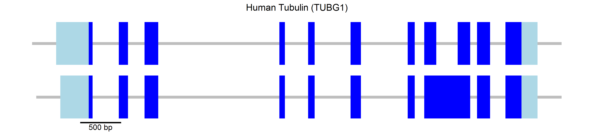
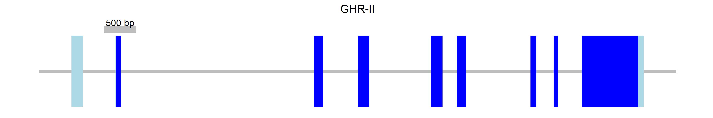
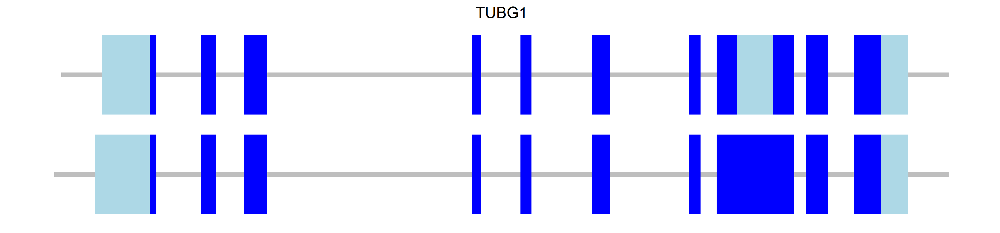
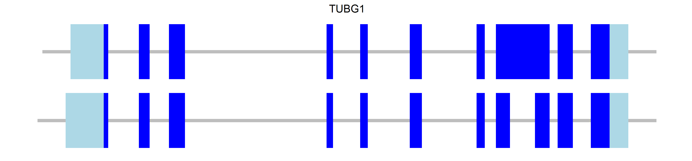
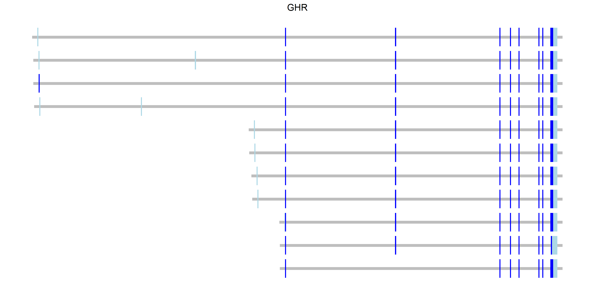
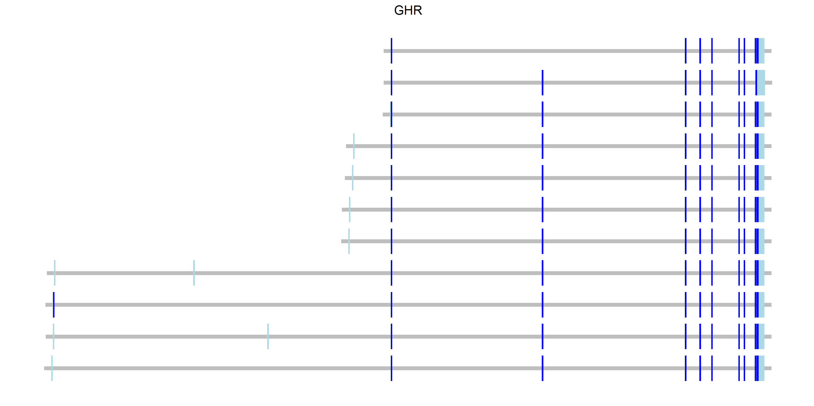
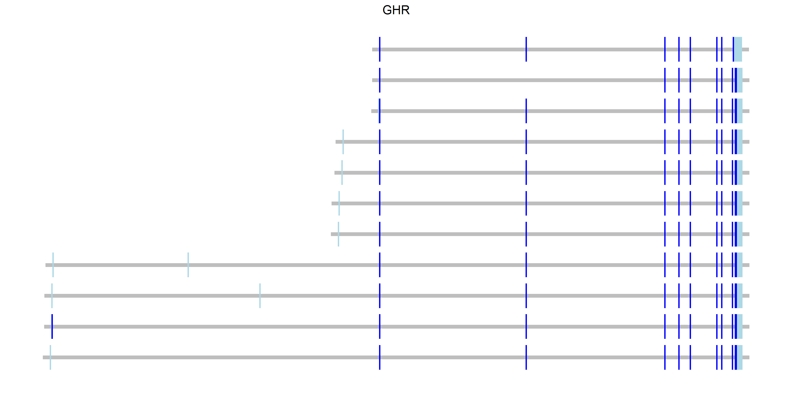
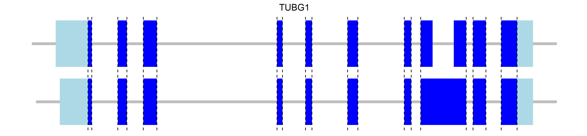

gGENEplot
=========

I present here a function to parse genbank files and generate exon/intron diagrams using `ggplot`.

The following graph has been created from the human Tubulin [genbank file](https://www.ncbi.nlm.nih.gov/nuccore/NC_000017.11?report=genbank&from=42609340&to=42615238)



Installation
============

Download the repository from [github](https://github.com/alfonsosaera/gGENEplot.git) or clone it by typing in the terminal

    git clone https://github.com/alfonsosaera/gGENEplot.git

Usage
=====

You can copy the function from the `gGENEplot_function.R` file or load it using `source`

``` r
source("gGENEplot_function.R")
```

A simple plot with a single transcript can be created with the following code

``` r
gGENEplot("gb_files/sequence.gb")
```

    ## Loading required package: gsubfn

    ## Loading required package: proto

    ## Loading required package: ggplot2


and save it using `ggsave`, which also allows you to modify its proportions

``` r
ggsave("README_files/sequence.png", width = 30, height = 5, units = "cm")
```


Scale bar
---------

An scale bar can be added using `bar`

``` r
p <- gGENEplot("gb_files/sequence.gb", bar = T)
ggsave("README_files/sequence2.png", width = 30, height = 5, units = "cm")
```


and further customized with `bar.pos`, `bar.color`, `bar.size` and `bar.length`

``` r
p <- gGENEplot("gb_files/sequence.gb", bar = T,
               bar.pos = "top",    # "bottom" (default) or "top"
               bar.color = "gray", # default is black
               bar.size = 4,       # size of scale bar line in points
               # bar.size default is line.size/2 
               # see appearance for details on line.size
               bar.length = 500    # length in base pairs
               )
ggsave("README_files/sequence3.png", width = 30, height = 5, units = "cm")
```



Appearance
----------

Line size and color, and mRNA and CDS colors can be modified as desired with `line.color`, `line.size`, `intron.color` and `exon.color`.

``` r
p <- gGENEplot("gb_files/sequence.gb", bar = T,
               line.color = "blue",   # color of the "genome" line
               line.size = 8, # size of "genome" line in points, default is 2
               line.overhang = 0.3,   # portion of the line before/after gene
               intron.color = "green", exon.color = "red",
               bar.size = 1) 
ggsave("README_files/sequence4.png", width = 30, height = 5, units = "cm")
```


The `line.overhang` argument can be set to a percentage of the total length of the gene (0 to 1) or an absolute length in base pair number (&gt;=1).

The `min.size` argument controls the minimum size that an exon must have so it can be visible, if an exon is smaller will be enlarged. As the `min.size` argument, it can be set to a percentage (0 to 1) or an absolute length in base pairs (&gt;=1). `min.size` is 0.001.

``` r
p <- gGENEplot("gb_files/sequence2.gb", bar = T)
ggsave("README_files/sequence5.png", width = 30, height = 5, units = "cm")
```


`min.size` set to 0.002

``` r
p <- gGENEplot("gb_files/sequence2.gb", bar = T, min.size = 0.002)
ggsave("README_files/sequence6.png", width = 30, height = 5, units = "cm")
```


`min.size` set to 200

``` r
p <- gGENEplot("gb_files/sequence2.gb", bar = T, min.size = 200)
ggsave("README_files/sequence6.png", width = 30, height = 5, units = "cm")
```


As seen in these diagrams, using `min.size` can make some introns disappear. A solution to this is shown [below](#naming-transcripts).

Dealing with more than one transcript
-------------------------------------

`gGENEplot` can deal with multiple transcripts per gene

``` r
p <- gGENEplot("gb_files/humanTUB.gb")
ggsave("README_files/sequence7.png", width = 30, height = 7, units = "cm")
```



However, a caveat of using genbank files is that mRNA transcript names and CDS transcript names do not have the same exact name so it is difficult to make an automatic parser. The function has two ways of dealing with this problem, providing the order of the transcripts or the names.

### Correcting transcript order

The previous plot can be corrected using `mRNA.order`

``` r
p <- gGENEplot("gb_files/humanTUB.gb", mRNA.order = c(2,1))
ggsave("README_files/sequence8.png", width = 30, height = 7, units = "cm")
```


or `CDS.order`

``` r
p <- gGENEplot("gb_files/humanTUB.gb", CDS.order = c(2,1))
ggsave("README_files/sequence9.png", width = 30, height = 7, units = "cm")
```



The [human GHR gene](https://www.ncbi.nlm.nih.gov/nuccore/NC_000005.10/?report=genbank&from=42423775&to=42721878) will illustrate an example of multiple number of transcripts. The next table shows the order that mRNA or CDS are read and their name.

| mRNA order | mRNA name  | CDS order | CDS name  |
|:----------:|------------|:---------:|-----------|
|      1     | variant 1  |     1     | variant 2 |
|      2     | variant 3  |     2     | variant 2 |
|      3     | variant 2  |     3     | variant 2 |
|      4     | variant 4  |     4     | variant 2 |
|      5     | variant 5  |     5     | variant 2 |
|      6     | variant 6  |     6     | variant 2 |
|      7     | variant 7  |     7     | variant 2 |
|      8     | variant 8  |     8     | variant 2 |
|      9     | variant 9  |     9     | variant 2 |
|     10     | variant 12 |     10    | variant 2 |
|     11     | variant 10 |     11    | variant 2 |

``` r
p <- gGENEplot("gb_files/humanGHR.gb", min.size = 0.002, line.overhang = 0.01)
ggsave("README_files/human1.png", width = 30, height = 15, units = "cm")
```


The second transcript from the top shows the order error. This can be fixed with `CDS.order`.

``` r
p <- gGENEplot("gb_files/humanGHR.gb", min.size = 0.002, line.overhang = 0.01, 
               CDS.order = c(9,2,1,3:8,11,10))
ggsave("README_files/human2.png", width = 30, height = 15, units = "cm")
```


Transcripts can be reordered combining `mRNA.order` and `CDS.order`

``` r
p <- gGENEplot("gb_files/humanGHR.gb", min.size = 0.002, line.overhang = 0.01, 
               mRNA.order=c(11:1), CDS.order = c(10, 11, 8:3, 1,2,9))
ggsave("README_files/human3.png", width = 30, height = 15, units = "cm")
```



### Naming transcripts

Names can be assigned to mRNA and CDS blocks with `mRNA.names` and `CDS.names`. The names must be the same for both mRNA and CDS blocks, the order has been taken from the table above.

``` r
NAMES.mRNA <- c("var 1", "var 3", "var 2", "var 4", "var 5", "var 6", "var 7",
                "var 8", "var 9", "var 12", "var 10")

NAMES.CDS <- c("var 2", "var 3", "var 4", "var 5", "var 6", "var 7", "var 8", 
               "var 9", "var 1", "var 10", "var 12")
```

If transcripts are named, the names are used to automatically correct the order.

``` r
p <- gGENEplot("gb_files/humanGHR.gb", min.size = 0.002, line.overhang = 0.01, 
               mRNA.names = NAMES.mRNA, CDS.names = NAMES.CDS)
ggsave("README_files/human4.png", width = 30, height = 15, units = "cm")
```



or rearranged as desired with `names.order`

``` r
newORDER <- c("var 1", "var 2", "var 3", "var 4", "var 5", "var 6", "var 7",
                "var 8", "var 9", "var 10", "var 12")
p <- gGENEplot("gb_files/humanGHR.gb", min.size = 0.002, line.overhang = 0.01, 
               mRNA.names = NAMES.mRNA, CDS.names = NAMES.CDS,
               names.order = newORDER)
ggsave("README_files/human5.png", width = 30, height = 15, units = "cm")
```


naming the transcripts also allows to check the intron sizes so they do not desapear when the exon size is corrected (compare this and the previous diagram)

``` r
newORDER <- c("var 1", "var 2", "var 3", "var 4", "var 5", "var 6", "var 7",
                "var 8", "var 9", "var 10", "var 12")
p <- gGENEplot("gb_files/humanGHR.gb", min.size = 0.002, line.overhang = 0.01, 
               mRNA.names = NAMES.mRNA, CDS.names = NAMES.CDS,
               names.order = newORDER, check.introns = T)
ggsave("README_files/human6.png", width = 30, height = 15, units = "cm")
```



When using `check.introns`, introns minimum size is defined by `min.size` (default, 0.001, or user-defined)

Fixing intron issue when using `min.size` shown before.

``` r
p <- gGENEplot("gb_files/sequence2.gb", bar = T, min.size = 200, 
               mRNA.names = "GHR-I", CDS.names = "GHR-I", check.introns = T)
ggsave("README_files/intronFIX.png", width = 30, height = 5, units = "cm")
```

before


after


Further customization
---------------------

Since the function returns a `ggplot` object, you can add your own modifications.

### Change title

The gene diagram title can be easily modified with `ggtitle`.

``` r
p <- gGENEplot("gb_files/humanTUB.gb", mRNA.order = c(2,1), bar = T, 
               bar.length = 500)
p <- p + ggtitle("Human Tubulin (TUBG1)")
ggsave("README_files/tub.png", width = 30, height = 7, units = "cm")
```


### Add extra lines

Furhter customizing the previous gene diagram, vertical lines can be added with `geom_vline`. The coordinates for `xintercept` can be obtained from the [genbank file](https://www.ncbi.nlm.nih.gov/nuccore/NC_000017.11?report=genbank&from=42609340&to=42615238).

``` r
p <- p + geom_vline(xintercept = c(399, 447, 769, 881, 1084, 1251, 2736, 2804, 
                                   3088, 3167, 3608, 3734, 4308, 4394, 4510, 
                                   5073, 5157, 5318, 5505, 5702), 
                    color = "black", linetype = "dashed")
ggsave("README_files/tub2.png", width = 30, height = 7, units = "cm")
```



### Add transcript names

To add labels with `geom_text` x and y coordinates must be provided. `df.text` is created to add the labels.

``` r
# Create and store gene diagram
newORDER <- c("var 1", "var 2", "var 3", "var 4", "var 5", "var 6", "var 7",
                "var 8", "var 9", "var 10", "var 12")
p <- gGENEplot("gb_files/humanGHR.gb", min.size = 0.002, line.overhang = 0.01, 
               mRNA.names = NAMES.mRNA, CDS.names = NAMES.CDS,
               names.order = newORDER)

# define x y coordinates and labels
df.text <- data.frame("labels" = newORDER, "y" = (seq(0, 10) * 0.5) + 3, 
                      "x" = rep(307000, 11))

# add labels to gene diagram
p <- p + geom_text(data=df.text, aes(x = x, y = y, label = labels), hjust = 0)
ggsave("README_files/human7.png", width = 30, height = 15, units = "cm")
```


